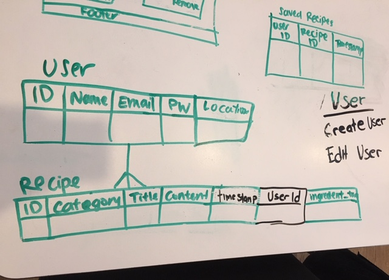
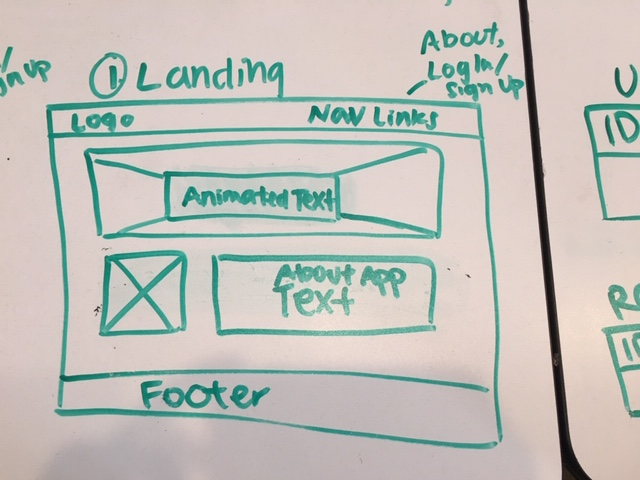
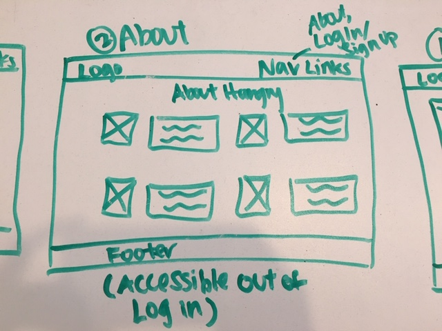
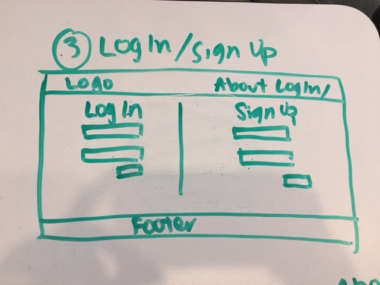
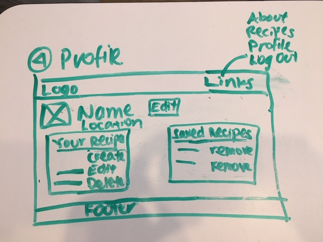
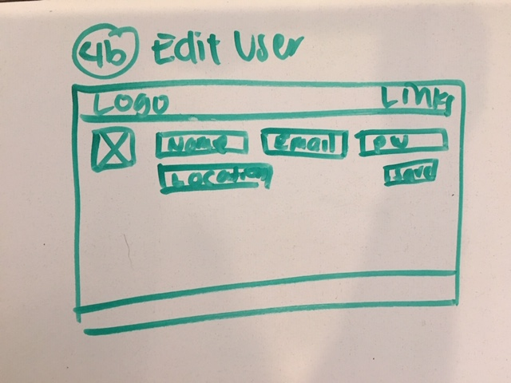
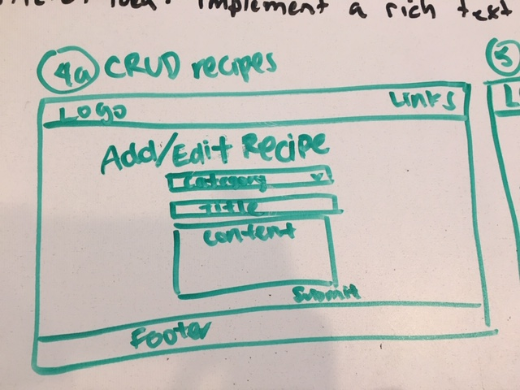
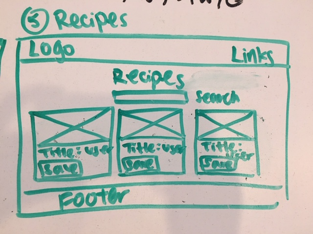

# hangry

## Overview
Hangry is a platform for food lovers to share their favorite recipes and save food recipes created by other users. Users must register or login to view, create, and save recipes.  They have the ability to edit their profile information, edit and delete their created recipe or remove a recipe from their saved collection. 
Hangry was created by Brandon Castillo, Christina Hastenrath, Nicolette Lewis and Ronni Louie.

## Demo Note
Currently, Heroku and Flask Image Uploader is unsupported so it is deployed without the uploader due to errors.

## Wireframes and User Stories
Our database consists of 2 relational tables (User, Recipe) and one junction table (Saved Recipes)

These wireframes below also reflect the user flow through the app.

## Technologies Used
Languages
- HTML
- CSS
- Python
- JavaScript

Frameworks
- Flask
- Bulma.css

Libraries
- jQuery
- Typed.js

## Installation
You can install this project's dependencies and run it locally.  It is currently hosted on [Heroku](https://project-hangry.herokuapp.com/), but as Heroku is a free hosting service, it is not supporting our image uploader feature.  We are currently working on removing that feature to complete a successful launch on Heroku.

- Clone down repo
- Run a terminal and cd to folder
- Open a new terminal (CMD+T) and run 'pip3 install virtualenv' followed by 'virtualenv .env -p python3'
- Run 'source .env/bin/activate' in the same terminal to activate environment
- Run pip install -r requirements.txt to install depenendcies
- Run 'python3 app.py' to run application
- Open browser and go to http://127.0.0.1:8000 to run on local machine

## Wish List/Future Development
- Search bar to search recipes by ingredient tags
- Notifications/alerts using BulmaJS for successfully saving recipes and removing a saved recipe
- Heroku deployment
- Default image for users who choose not to upload
- Rich text editor to help display recipe's ingredients and instructions separately/better
- Solve lingering issues:
  - The issue of data validators making a couple of forms break
  - Regex validators not working on some forms
  - Edit recipe's content has to be used as a placeholder, so user loses all text when clicking into text area field

## Contributors
Brandon Castillo - <a href="https://github.com/brandonmcastillo">GitHub</a>
Christina Hastenrath - <a href="https://github.com/ch264">GitHub</a>
Nicolette Lewis - <a href="https://github.com/LewNic1">GitHub</a>
Ronni Louie - <a href="https://github.com/ronsbons">GitHub</a>
