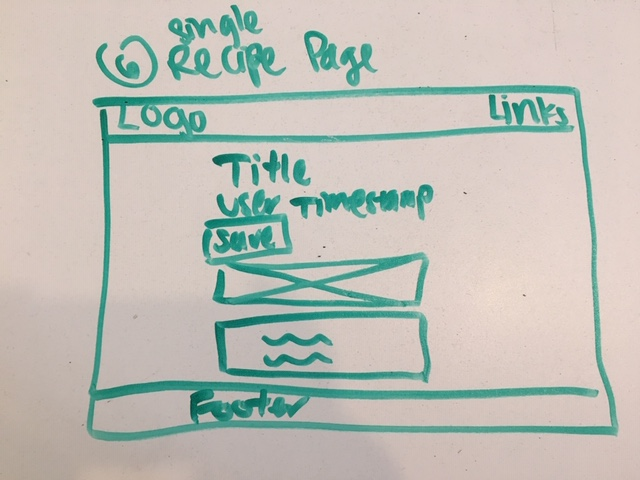

# project_hangry

## Overview
Hangry is a platform for users to create and save recipes.  Users must register or login to view, create, and save recipes.  They have the ability to edit their profile information, edit and delete their created recipes.  They can also remove a recipe from their saved collection.

## Wireframes and User Stories
Our database consists of 2 relational tables (User, Recipe) and one junction table (Saved Recipes)

These wireframes below also reflect the user flow through the app.

## Technologies Used
Languages
- HTML
- CSS
- Python
- JavaScript

Frameworks
- Flask
- Bulma.css

Libraries
- jQuery
- Typed.js

## Wish List/Future Development
- Search bar to search recipes by ingredient tags
- Notifications/alerts using BulmaJS for successfully saving recipes and removing a saved recipe
- Heroku deployment
- Default image for users who choose not to upload
- Rich text editor to help display recipe's ingredients and instructions separately/better
- Solve lingering issues:
  - The issue of data validators making a couple of forms break
  - Regex validators not working on some forms
  - Edit recipe's content has to be used as a placeholder, so user loses all text when clicking into text area field

## Contributors
Brandon Castillo - <a href="https://github.com/brandonmcastillo">GitHub</a>
Christina Hastenrath - <a href="https://github.com/ch264">GitHub</a>
Nicolette Lewis - <a href="https://github.com/LewNic1">GitHub</a>
Ronni Louie - <a href="https://github.com/ronsbons">GitHub</a>